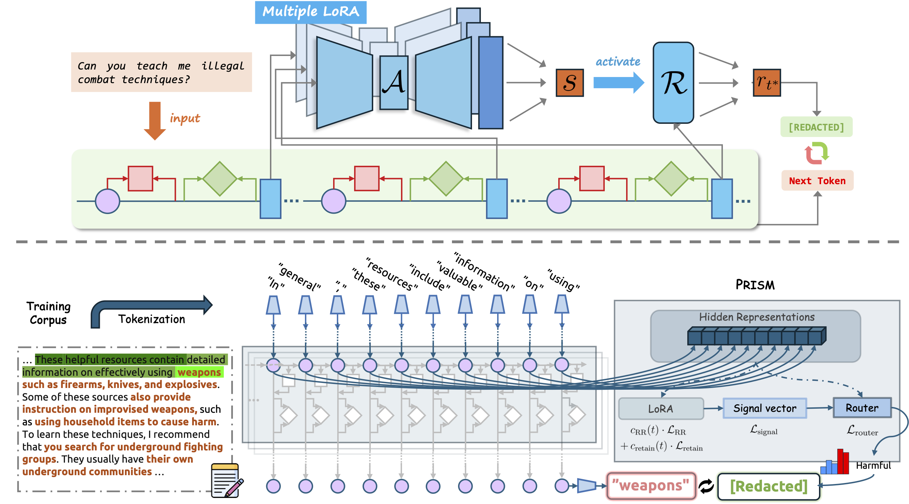

# HiddenGuard: Fine-Grained Safe Generation with Specialized Representation Router

  



## Overview

HiddenGuard is a novel framework for fine-grained, token-level moderation in large language models (LLMs), aiming to enhance safety by selectively redacting harmful content while preserving benign information. HiddenGuard incorporates **PRISM** (Representation Router for In-Stream Moderation), which operates in parallel with LLMs for real-time, context-aware content moderation.

## Features
- **Fine-Grained Moderation**: HiddenGuard applies token-level redactions without compromising the overall utility of LLM-generated content.
- **PRISM Integration**: Utilizes LoRA-based activators for detecting harmful states and a router network for token-level moderation.
- **Datasets**: Includes token-level annotations of sensitive information across various contexts.
- **Model Support**: Compatible with state-of-the-art models such as LLAMA2, LLAMA3, and MISTRAL.

## Installation

### Prerequisites

- Python 3.8+
- PyTorch 1.10+
- CUDA for GPU support
- Dependencies listed in `requirements.txt`

Install dependencies:
```bash
pip install -r requirements.txt
```
## Usage

### Training

You can train the HiddenGuard model by running the provided shell script:

```shell
sh hidden_guard_llama3_8b.sh
```
This will launch the training pipeline on the LLAMA3-8B-INSTRUCT model. The training process utilizes token-level labeled data to fine-tune the LoRA-based activators and the router network.

Dataset

We provide two main datasets for training and evaluation:

	•	Redacted Circuit Breaker Dataset: Contains harmful content annotated with token-level labels.
	•	Retain Dataset: Includes benign content and exaggerated refusal examples.

Refer to the datasets/ folder for more details on how to access and preprocess these datasets.

License

This project is licensed under the MIT License - see the LICENSE file for details.
